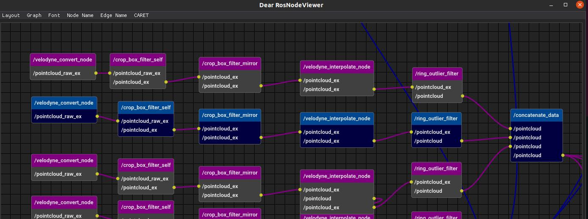

# Scripts to Generate Path Analysis Report

## Required
```
sudo pip install webdrivermanager
sudo webdrivermanager firefox --linkpath /usr/local/bin
```

## Scripts

- `add_path_to_architecture.py`
    - Creates architecture_path.yaml which contains path information
- `path_analysis.py`
    - Creates html files containing graph:
        - messageflow
        - histogram
    - Saves stats information to yaml file
- `make_report_path.py`
    - Creates report html page


```sh
python3 add_path_to_architecture.py path-to-target_path --architecture_file_src=path-to-architecture --max_node_depth=20
  or
python3 add_path_to_architecture.py path-to-target_path --trace_data=path-to-trace_data --max_node_depth=20

python3 path_analysis.py path-to-trace_data architecture_path.yaml -f
python3 make_report_path.py report_ooo/
```

- Note:
    - In case `add_path_to_architecture.py` is stuck, decrease smaller number for  `--max_node_depth` option

## Inputs

- trace_data
    - e.g.: `~/.ros/tracing/autoware_launch_trace_20220722-162413/`
    - trace data generated by CARET
- architecture_file (optional)
    - e.g.: `architecture.yaml`
    - architecture.yaml created from trace_data
    - redundant conversion is omitted if you specify a pre-generated architecture_file
- target_path
    - e.g.: `target_path.json`
    - json file describing path information

## Outputs

- `report_ooo/path/`
    - `index.html` : report main page
    - `ooo.html` : sub pages containing graph

## How to generate target_path.json

### Format

- name
    - name of the path (can be any, but do not use a duplicated name)
- path:
    - list of nodes
    - If you want to specify topic, use list ( `[node_name, topic_name]` )

```json
[
    {
        "name": "path_name",
        "path": [
            "The first node_name in the path",
            "The second node_name in the path",
            ["The third node_name in the path", "The topic name published by the third node"]
            "...",
            "The last node_name in the path",
        ]
    },
    {
        "name": "sample_path",
        "path": [
            "/node_1",
            "/node_2",
            ["/node_3", "/topic_3"],
            "/node_4_.*"
        ]
    }
]
```

### Easy way to create target_path.json

- Install [Dear RosNodeViewer](https://github.com/takeshi-iwanari/dear_ros_node_viewer)
- Open graph ( e.g.: `dear_ros_node_viewer architecture.yaml` )
- Select nodes in the path which you want to analyze
    - ctrl + click
- Press C to export node name list to clip board
- Paste the exported node name list to json file




### Note:

- Regular expression is suppoted
    - In case a node name varies for each execution, you can write node name in JSON like the following
    - Before: `object_association_merger_abc1234567_1234567_1234567891234567891`
    - After: `object_association_merger.*`